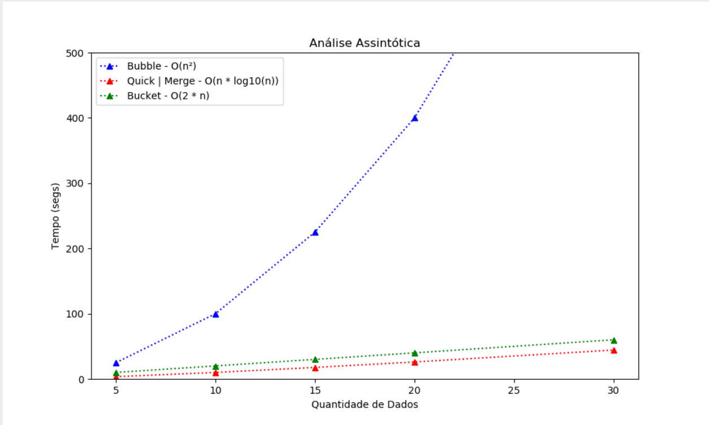

# 🌟 Sort Generator 🌟

----
### `❓ What's it? ❓`

* Sort Generator is a website developed to sort Strings and Integers datas. Actually, it uses **Merge, Bubble, Bucket and Quick* Sort Algorithms.

* I needa translate this project's contents to English too 😂😂

----
### `⚒️ Tools ⚒️`

* HTML, CSS, JavaScript;
* JQuery 3.6 version or later, JChart and Slick;
* Any Browser (tested succesfully in Chrome, Opera and OperaGX);
* Eclipse IDE;
* Java 8 version or later;
* Apache TomCat 9 version or later.

----
### `⚙️ Run ⚙️`

* Download the source code;
* Import **sort-generator.war** in your Eclipse IDE;
* Set the project into your TomCat server;
* Start the server;
* Open **index.jsp** file into the browser.

----
### `📝 Examples 📝`

> Sort Integer Numbers

* Go to *Ordenação - Inteiros*;
* Generate Random Numbers, Import txt file (use comma to separate each data) or Tip you the datas;
* Click in *Ordenar* button and see the result.

> Sort Strings

* Go to *Ordenação - Strings*;
* Import txt file (use comma to separate each data) or Tip you the datas;
* Click in *Ordenar* button and see the result.

----
### `🎁 Bonus 🎁`

* About the algorithms, these are the Assintotic Function of each:

```
- Bubble Sort: O(n^2)
- Quick and Merge Sort: O(n * log10(n))
- Bucket Sort: O(2 * n)

being 'n' the number of elements to sort.
```



----
### `✉️ Contact ✉️`

> **Email:** `csfelix08@gmail.com`

> **Linkedin:** `linkedin.com/in/gabriel-felix-dos-santos-7443151bb/`

> **Instagram:** `instagram.com/c0deplus/`
